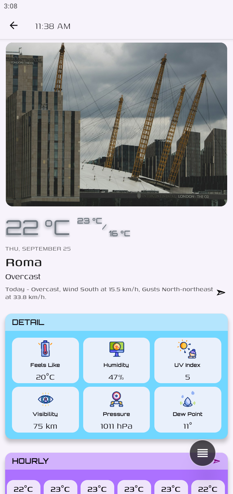
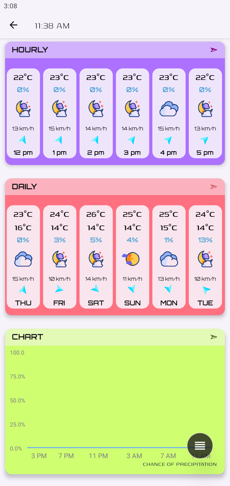
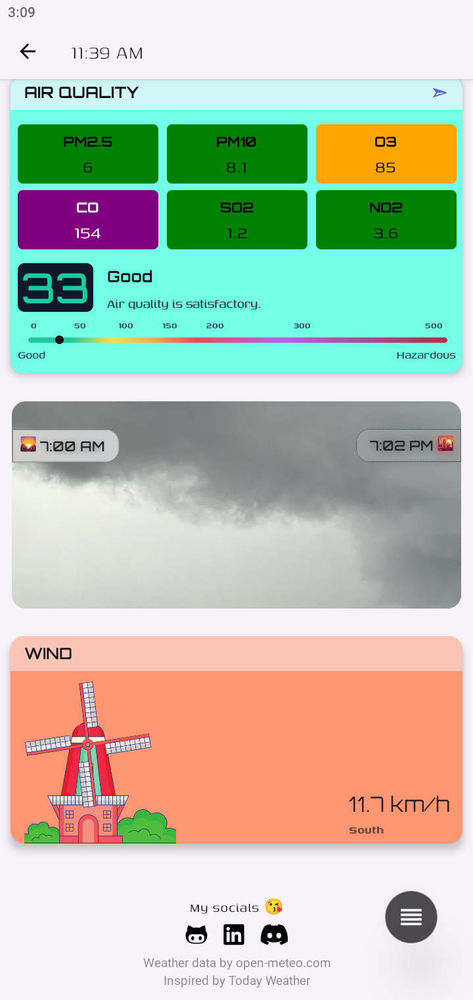
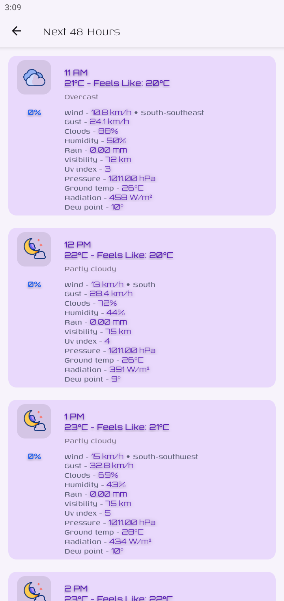
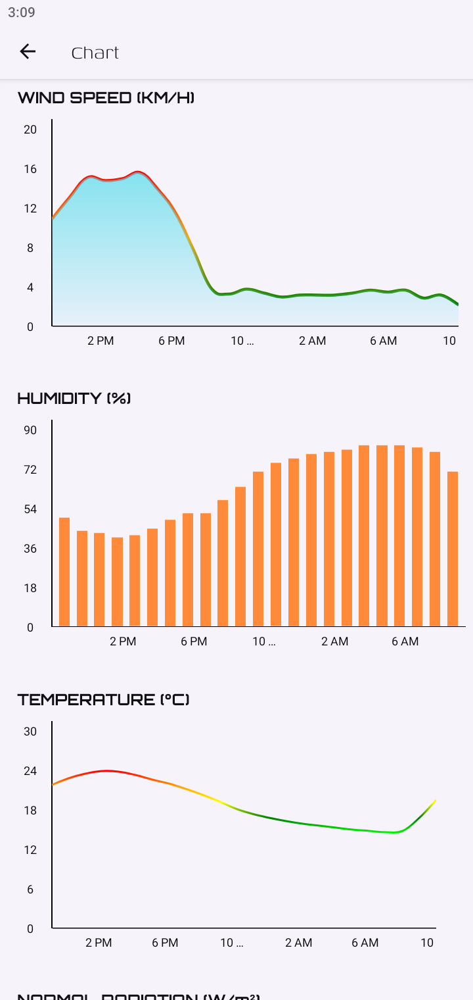
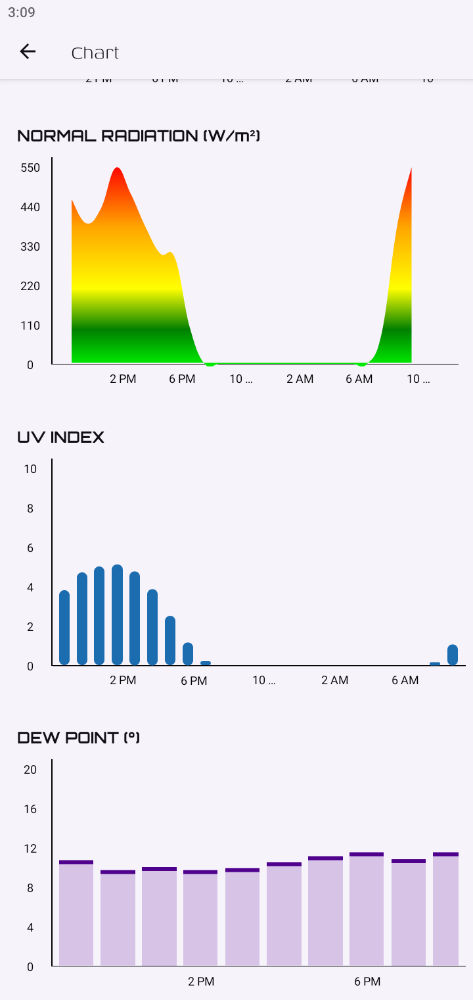
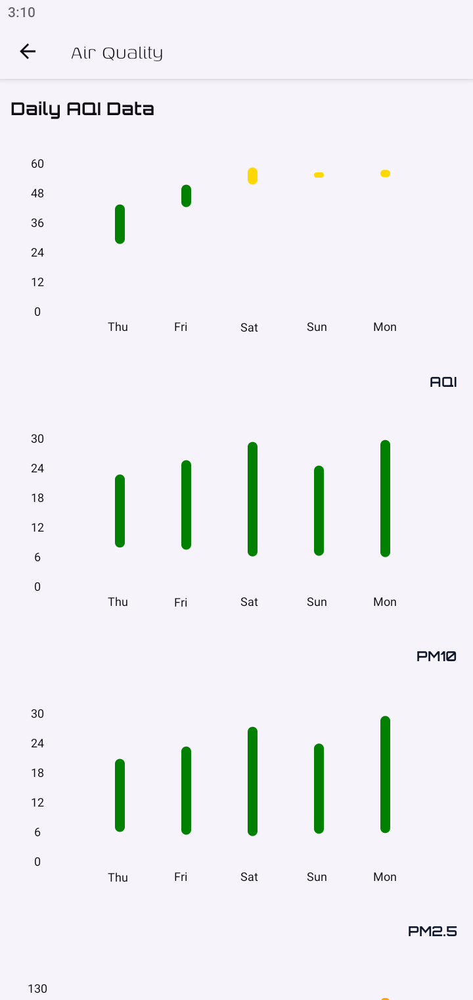
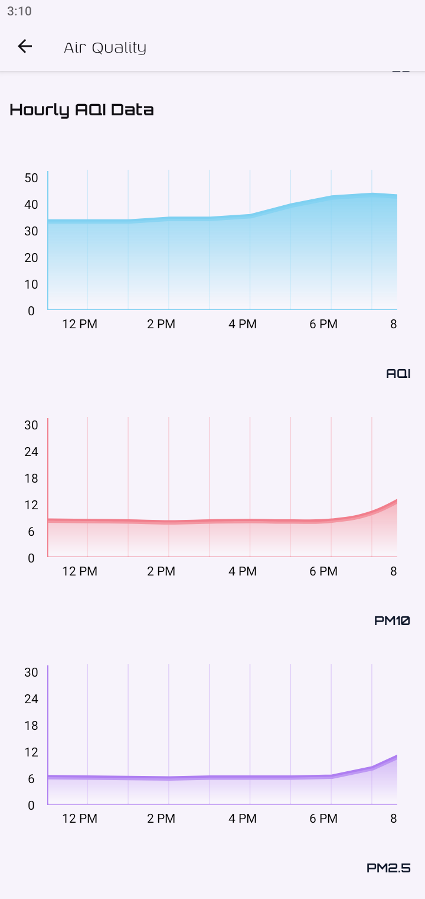
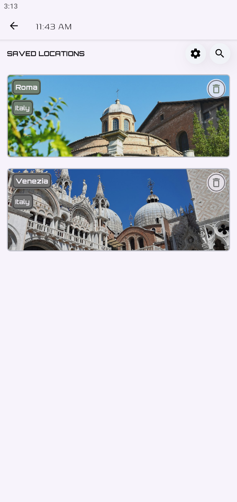
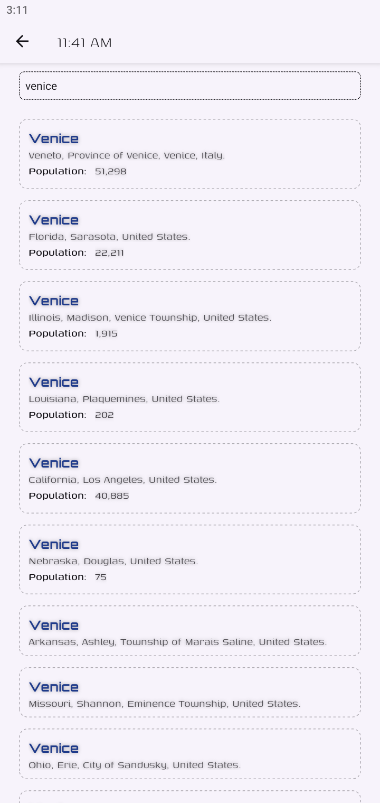

# Wetter Mobile ⛅

<p align="center">
 
</p>

<p align="center">


</p>
<p align='center'>


</p>

---

## 📺 Overview

Wetter (German for weather) is a weather/AQI forecast and app.

## ⛅ **Wetter Mobile** (React Native + Expo)

I created this app to showcase the ability of creating both Web apps and Native apps to land a job as a React Web/Native developer. This is my first fully-fledged working app which is a beautiful & simple-to-use weather app that provides the local weather and aqi forecasts.

## 🎉 Features

- **⛅ Timely forecast**: Current, hourly and daily forecasts,
- **🌞 Unsplash Image**: Showing image based on weather code,
- **🌚 Dark 🌕 Light** theme: `useColorsScheme()` for finding system theme preference,
- **🌤️ React Gifted Charts**: Various graphs for weather and AQI data,
- **⛈️ Location search**: Save multiple locations and find any location using search bar,
- **❄️ Notification**: Scheduled weather/aqi or daily notification settings,
- **🌟 Reanimated**: Reanimated library for multiple animations,
- **🌪️ Persistent State**: Async storage with zustand to persist multiple datasets,
- **⚙️ Multiple settings**: For managing some features of the app i.e. notification, alerts and units,
- **⚡ Beautiful UI**: Clean, colorful and modern interface design,
- **☔ Completely Free & Ad-Free**: Enjoy the app without any cost or advertisements,

## Development Setup

```bash
cd wetter_mobile
cd wetter_mobile/
npm install
npm run android/ios
```

## Build for Production

```bash
cd wetter_mobile/

# Development Build
eas build --platform android --profile development

# Preview Build (APK)
eas build --platform android --profile preview

# Production Build
eas build --platform android --profile production
```

## 💻 Resources

### 📄 API

- `open-meteo weather API`: For getting current, daily(15 days), hourly(48 hours) and AQI(5 days) forecast,
- `open-meteo Air quality API`: For getting AQI,
- `Unsplash`: For fetching Images according to weather type,
- `open-meteo Geocoding API and phone location`: For location data,

### ✨ Some of the Dependencies

- expo: `53.0.23`
- expo-asset: `11.1.7`,
- expo-location: `18.1.6`
- expo-notifications: `0.31.4`
- zustand: `5.0.7`
- tanstack/react-query: `5.85.3`
- nativewind: `4.1.23`
- tailwindcss: `3.4.17`,
- react: `19.0.0`
- react-native: `0.79.5`
- typescript: `5.8.3`
- react-native-async-storage/async-storage: `2.2.0`,
- react-native-community/netinfo: `11.4.1`,
- react-native-community/datetimepicker: `8.4.1`
- react-native-gifted-charts: `1.4.63`
- react-native-image-colors: `2.5.0`
- react-native-paper: `5.14.5`
- react-native-reanimated: `3.17.4`
- react-native-svg: `15.11.2`

## 📱 Screenshots

<details>
  <summary>Expand</summary>

| <h2>Home</h2>                        |
| ------------------------------------ |
|  |

| <h2>Days</h2>                        |
| ------------------------------------ |
|  |

| <h2>Wind</h2>                        |
| ------------------------------------ |
|  |

| <h2>Hourly</h2>                        |
| -------------------------------------- |
|  |

| <h2>Days</h2>                        |
| ------------------------------------ |
|  |

| <h2>WEATHER CHART 1</h2>               |
| -------------------------------------- |
|  |

| <h2>WEATHER CHART 2</h2>               |
| -------------------------------------- |
|  |

| <h2>AQI 1</h2>                       |
| ------------------------------------ |
|  |

| <h2>AQI 2</h2>                       |
| ------------------------------------ |
|  |

| <h2>Saved Locations</h2>                        |
| ----------------------------------------------- |
|  |

| <h2>Location search</h2>                       |
| ---------------------------------------------- |
|  |

</details>

## 🔐 Environment Configuration

This project requires a single environment variable to function correctly.

- The required **value** to complete your `.env` file is to go to _`unsplash`_ to get images and _`open-meteo`_ doesn't require api keys.

## 📄 License

This project is open-source and licensed under the MIT License. See the `LICENSE` file for more information.

---

<p align="center">
  <strong>⭐ If you like this project, please give it a star! ⭐</strong>
  <br />
  <em>Your support will help me boost my portfolio.</em>
</p>
